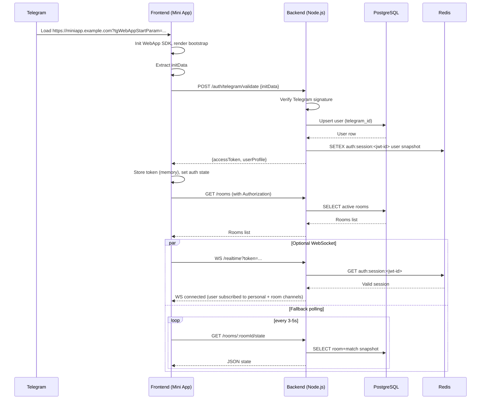

## System Architecture Document — Telegram Mini App «Дурак / Переводной Дурак»

### 1. Overview

- **Stack**: Telegram Mini App frontend (SPA), Node.js backend (TypeScript, Express/Fastify-style HTTP, WebSocket for realtime), PostgreSQL, Redis.
- **Deployment**: Single VPS (Linux), Nginx as reverse proxy/SSL terminator, Node.js process manager (PM2/systemd), external managed PostgreSQL (preferred) or local, Redis.
- **Key requirements**:
  - Mini App **стабильно открывается без зависимости от WebSocket** (первый экран, авторизация и bootstrap — через HTTP).
  - **Модульная архитектура**: `bot`, `auth`, `room`, `match`, `game-engine`, `realtime`, `stats`, `billing`, `admin`.
  - **Fault-tolerant match recovery**: состояние матча хранится в PostgreSQL + Redis; при реконнекте клиент восстанавливает состояние через HTTP, realtime — опционален.

### 2. Project Structure (High-level)

```text
.
├── backend
│   ├── src
│   │   ├── app.ts
│   │   ├── server.ts
│   │   ├── config
│   │   │   └── index.ts
│   │   ├── infrastructure
│   │   │   ├── http
│   │   │   │   ├── routes.ts
│   │   │   │   └── middlewares
│   │   │   │       ├── authContext.ts
│   │   │   │       └── errorHandler.ts
│   │   │   ├── db
│   │   │   │   ├── index.ts
│   │   │   │   └── migrations
│   │   │   │       └── 0001_init.sql
│   │   │   ├── redis
│   │   │   │   └── index.ts
│   │   │   └── realtime
│   │   │       └── websocketServer.ts
│   │   ├── modules
│   │   │   ├── bot
│   │   │   │   ├── bot.controller.ts
│   │   │   │   ├── bot.service.ts
│   │   │   │   └── telegram.webhook.ts
│   │   │   ├── auth
│   │   │   │   ├── auth.controller.ts
│   │   │   │   ├── auth.service.ts
│   │   │   │   └── auth.types.ts
│   │   │   ├── room
│   │   │   │   ├── room.controller.ts
│   │   │   │   ├── room.service.ts
│   │   │   │   └── room.types.ts
│   │   │   ├── match
│   │   │   │   ├── match.controller.ts
│   │   │   │   ├── match.service.ts
│   │   │   │   └── match.events.ts
│   │   │   ├── game-engine
│   │   │   │   ├── engine.service.ts
│   │   │   │   └── engine.types.ts
│   │   │   ├── realtime
│   │   │   │   ├── realtime.gateway.ts
│   │   │   │   └── realtime.types.ts
│   │   │   ├── stats
│   │   │   │   ├── stats.controller.ts
│   │   │   │   └── stats.service.ts
│   │   │   ├── billing
│   │   │   │   ├── billing.controller.ts
│   │   │   │   └── billing.service.ts
│   │   │   └── admin
│   │   │       ├── admin.controller.ts
│   │   │       └── admin.service.ts
│   │   └── shared
│   │       ├── logger.ts
│   │       ├── errors.ts
│   │       └── types.ts
│   ├── package.json
│   ├── tsconfig.json
│   └── .env.example
├── frontend
│   ├── index.html
│   ├── src
│   │   ├── main.tsx
│   │   ├── app
│   │   │   ├── App.tsx
│   │   │   ├── routes.tsx
│   │   │   └── queryClient.ts
│   │   ├── modules
│   │   │   ├── auth
│   │   │   │   ├── useTelegramAuth.ts
│   │   │   │   └── AuthGate.tsx
│   │   │   ├── lobby
│   │   │   │   └── LobbyPage.tsx
│   │   │   ├── match
│   │   │   │   └── MatchPage.tsx
│   │   │   ├── profile
│   │   │   │   └── ProfilePage.tsx
│   │   │   └── admin
│   │   │       └── AdminPage.tsx
│   │   ├── shared
│   │   │   ├── apiClient.ts
│   │   │   ├── realtimeClient.ts
│   │   │   └── ui
│   │   │       ├── Button.tsx
│   │   │       └── Layout.tsx
│   ├── package.json
│   └── tsconfig.json
└── docs
    └── architecture.md
```

### 3. Data Flow запуска Mini App

1. **User opens Mini App** из Telegram чата/бота.
2. Telegram WebView загружает `https://<domain>/miniapp/` (Nginx → `frontend` static bundle).
3. `frontend`:
   - Инициализирует Telegram WebApp SDK.
   - Извлекает `initData` / `initDataUnsafe` и отправляет их на `backend /auth/telegram/validate` по HTTPS.
4. `backend/auth`:
   - Валидирует подпись Telegram (`hash`).
   - Создаёт/обновляет запись `users` в PostgreSQL, пишет базовую сессию в Redis (`user_session:<user_id>`).
   - Возвращает **short-lived JWT** + базовый профиль пользователя + флаги (есть ли активный матч, незавершённые игры).
5. `frontend`:
   - Сохраняет JWT в памяти (React Query/Context, НЕ в `localStorage`).
   - Запрашивает `/room/overview` по HTTP.
   - Рендерит **Lobby**/первый экран (список комнат/быстрый поиск), **без ожидания WebSocket**.
6. После рендера Lobby:
   - `frontend` опционально инициализирует WebSocket-подключение к `wss://<domain>/realtime` с JWT.
   - При неудаче подключения UI продолжает работать на HTTP-пуле (polling/long-polling) и отображает уведомление о деградации realtime.

### 4. Sequence Diagram входа пользователя (text)

```text
User → Telegram Bot: /play
Telegram Bot → Mini App URL: openWebApp("https://<domain>/miniapp")
User → Frontend: HTTP GET /miniapp (static index.html + JS)
Frontend → Telegram SDK: init + get initData
Frontend → Backend `/auth/telegram/validate`: POST { initData }
Backend(auth) → Telegram API (optional): GET /getMe (health-check)
Backend(auth) → PostgreSQL: UPSERT user
Backend(auth) → Redis: SET user_session:<user_id>
Backend(auth) → Frontend: 200 { jwt, userProfile, activeMatchId? }
Frontend → Backend `/room/overview`: GET Authorization: Bearer <jwt>
Backend(room) → PostgreSQL: SELECT rooms, matches
Backend(room) → Frontend: 200 { rooms, userStats, activeMatch? }
Frontend: Render LobbyPage
Frontend → Backend `/realtime/ws`: WebSocket upgrade with jwt (optional)
Backend(realtime) → Redis: SUBSCRIBE match:<match_id> channel(s)
```

### 5. HTTP API Schema (High-level)

Base URL: `https://<domain>/api`

- **Auth module**
  - `POST /auth/telegram/validate`
    - Body: `initData` (string/raw from Telegram JS SDK).
    - Resp: `{ jwt, user: UserDTO, activeMatchId?: string }`.
- **Room module**
  - `GET /room/overview`
    - Resp: `{ rooms: RoomSummary[], userStats: UserStatsDTO, activeMatchId?: string }`.
  - `POST /room/create`
    - Body: `{ type: "classic" | "transferable", maxPlayers: 2 | 3 | 4, betAmount?: number }`.
  - `POST /room/join`
    - Body: `{ roomId: string }`.
  - `POST /room/leave`
    - Body: `{ roomId: string }`.
- **Match module**
  - `POST /match/start`
    - Body: `{ roomId: string }`.
  - `GET /match/state/:matchId`
    - Resp: полное стабильное состояние матча для восстановления после реконнекта.
  - `POST /match/action/:matchId`
    - Body: `{ type: "PLAY_CARD" | "TAKE_CARDS" | "PASS" | "DEFEND" | "TRANSFER" , payload: ... }`.
- **Stats module**
  - `GET /stats/me`
  - `GET /stats/leaderboard`
- **Billing module**
  - `POST /billing/tg-invoice/callback` (Telegram payments webhook).
  - `GET /billing/balance`
- **Admin module**
  - `GET /admin/rooms`
  - `GET /admin/matches`
  - `POST /admin/match/force-end`

### 6. Realtime Events (Match Events & Meta Events)

WebSocket namespace: `/realtime`, JWT-based auth.

**Client → Server events**

- `join_match`
  - Payload: `{ matchId: string }`
- `leave_match`
  - Payload: `{ matchId: string }`
- `match_action`
  - Payload: `{ matchId: string, type: ActionType, payload: any, clientActionId: string }`

**Server → Client events**

- `match_state`
  - Полное состояние матча:
  - Payload: `{ matchId, stateVersion, players, hands, table, trump, phase, attackerId, defenderId, deckCount, discardCount, turnTimer? }`
- `match_patch`
  - Инкрементальное обновление:
  - Payload: `{ matchId, fromVersion, toVersion, patches: Patch[] }`
- `match_event`
  - Высокоуровневые доменные события:
  - Types:
    - `MATCH_STARTED`
    - `TURN_STARTED`
    - `CARD_PLAYED`
    - `CARD_DEFENDED`
    - `CARDS_TAKEN`
    - `ROUND_FINISHED`
    - `MATCH_FINISHED`
  - Общий формат:
    - Payload: `{ matchId, type, data, ts }`
- `system_warning`
  - Например: деградация realtime, таймаут хода, реконнект.
- `ack`
  - Подтверждение экшена клиента:
  - Payload: `{ clientActionId, serverActionId, status: "ACCEPTED" | "REJECTED", reason? }`

### 7. DB schema (PostgreSQL)

Основные сущности:

- `users`
- `rooms`
- `matches`
- `match_players`
- `match_events` (event-sourcing для восстановления и аналитики)
- `billing_transactions`
- `user_balances`
- `stats_user_daily`

```sql
-- users
CREATE TABLE users (
  id BIGSERIAL PRIMARY KEY,
  telegram_id BIGINT NOT NULL UNIQUE,
  username TEXT,
  first_name TEXT,
  last_name TEXT,
  language_code VARCHAR(8),
  created_at TIMESTAMP WITH TIME ZONE DEFAULT now(),
  updated_at TIMESTAMP WITH TIME ZONE DEFAULT now()
);

-- rooms
CREATE TABLE rooms (
  id UUID PRIMARY KEY,
  owner_user_id BIGINT REFERENCES users(id),
  type TEXT NOT NULL, -- 'classic' | 'transferable'
  max_players INT NOT NULL,
  status TEXT NOT NULL, -- 'waiting' | 'in_progress' | 'finished'
  created_at TIMESTAMPTZ DEFAULT now(),
  updated_at TIMESTAMPTZ DEFAULT now()
);

-- matches
CREATE TABLE matches (
  id UUID PRIMARY KEY,
  room_id UUID REFERENCES rooms(id),
  type TEXT NOT NULL,
  status TEXT NOT NULL, -- 'in_progress' | 'finished' | 'aborted'
  trump_suit TEXT NOT NULL,
  state_version BIGINT NOT NULL DEFAULT 0,
  last_state JSONB NOT NULL, -- snapshot для быстрого восстановления
  created_at TIMESTAMPTZ DEFAULT now(),
  updated_at TIMESTAMPTZ DEFAULT now(),
  finished_at TIMESTAMPTZ
);

-- match_players
CREATE TABLE match_players (
  id BIGSERIAL PRIMARY KEY,
  match_id UUID REFERENCES matches(id),
  user_id BIGINT REFERENCES users(id),
  seat INT NOT NULL,
  is_winner BOOLEAN,
  cards_taken INT DEFAULT 0,
  UNIQUE (match_id, user_id)
);

-- match_events (event log)
CREATE TABLE match_events (
  id BIGSERIAL PRIMARY KEY,
  match_id UUID REFERENCES matches(id),
  seq BIGINT NOT NULL,
  event_type TEXT NOT NULL,
  payload JSONB NOT NULL,
  created_at TIMESTAMPTZ DEFAULT now(),
  UNIQUE (match_id, seq)
);

-- billing
CREATE TABLE billing_transactions (
  id BIGSERIAL PRIMARY KEY,
  user_id BIGINT REFERENCES users(id),
  amount NUMERIC(18,2) NOT NULL,
  currency VARCHAR(8) NOT NULL,
  source TEXT NOT NULL, -- 'telegram_invoice' etc
  external_id TEXT,
  created_at TIMESTAMPTZ DEFAULT now()
);

CREATE TABLE user_balances (
  user_id BIGINT PRIMARY KEY REFERENCES users(id),
  balance NUMERIC(18,2) NOT NULL DEFAULT 0,
  updated_at TIMESTAMPTZ DEFAULT now()
);

-- stats (denormalized)
CREATE TABLE stats_user_daily (
  user_id BIGINT REFERENCES users(id),
  date DATE NOT NULL,
  matches_played INT DEFAULT 0,
  matches_won INT DEFAULT 0,
  avg_turn_time_ms BIGINT DEFAULT 0,
  PRIMARY KEY (user_id, date)
);
```

### 8. Redis Key Structure

Prefix convention: `app:<env>:<domain>:<entity>:<id>`

- **Sessions**
  - `user_session:<user_id>` → JSON:
    - `{ userId, lastSeenAt, activeMatchId?, flags: {...} }`
  - TTL: 1–7 days.
- **Match runtime state (fast access)**
  - `match_state:<match_id>` → JSON snapshot:
    - `{ stateVersion, players, hands, deckCount, table, trump, phase, turnMeta }`
  - TTL: пока матч активен + grace-period (например, 24 часа).
- **Match locks**
  - `match_lock:<match_id>` → value: nodeId, TTL: 5–10 секунд, auto-renew.
  - Для эксклюзивной обработки ходов (action queue).
- **Realtime subscriptions / presence**
  - `match_presence:<match_id>` → Redis Set: userId's.
  - `user_ws:<user_id>` → список/счётчик активных WebSocket-сессий.
- **Rate limiting**
  - `ratelimit:<user_id>:<action>` → counter + TTL.

### 9. Game Engine Module (domain model)

`game-engine` модуль полностью **детерминистичен и изолирован**:

- Вход:
  - `GameState` (чистая структура данных).
  - `GameAction` (domain-команда).
- Выход:
  - Новый `GameState`.
  - Список `GameEvent` (для записи в `match_events` и отправки в WebSocket).

Основные типы:

- `Suit` (♠, ♥, ♦, ♣).
- `Rank` (6..A).
- `Card = { suit, rank }`.
- `GamePhase`:
  - `DEALING`, `PLAYING`, `FINISHED`.
- Поддержка режимов:
  - `classic` и `transferable` (правила перевода карт).

### 10. Fault Tolerance & Match Recovery

**Цель**: пользователь может:

- Перезагрузить Mini App.
- Потерять WebSocket соединение.
- Вернуться через несколько секунд/минут и продолжить матч **с консистентным состоянием**, даже если realtime временно недоступен.

Механизм:

1. **Все критичные состояния матча**:
   - Периодически сохраняются в PostgreSQL (`matches.last_state`, `state_version`).
   - Каждое изменение также логируется в `match_events` (event log).
2. **Redis** хранит актуальный runtime-state:
   - Быстрый доступ для realtime и HTTP.
   - Если Redis падает — состояние восстанавливается из PostgreSQL снапшота + прогонки событий.
3. **На реконнекте фронтенда**:
   - `frontend` вызывает `GET /match/state/:matchId`.
   - `match.service`:
     1. Пытается прочитать из Redis `match_state:<match_id>`.
     2. При отсутствии — читает `matches.last_state` + догоняет по `match_events` до последнего `seq`.
     3. Возвращает полное состояние, независимое от WebSocket.
   - `frontend` рендерит `MatchPage` на основе HTTP-ответа.
   - Далее **опционально** инициирует WebSocket и подписывается на инкрементальные `match_patch`.
4. **Идёмпотентность команд**:
   - Каждая команда имеет `clientActionId`.
   - В Redis/DB хранится мэппинг `clientActionId → serverActionId`.
   - Повторная отправка не приводит к дублированию хода.

### 11. Bot Module

Функции:

- Обработка `/start`, `/play`, `/help`.
- Генерация deep-link/Mini App URL:
  - `https://t.me/<bot_username>/miniapp?startapp=<payload>`
  - Payload может включать roomId/inviteId.
- Webhook endpoint:
  - `POST /bot/webhook` с телом `Update` от Telegram.
- Интеграция с Billing (инвойсы, чек).

Взаимодействие:

- `bot.service`:
  - Парсит команды.
  - Создаёт/находит `room` по запросу.
  - Высылает пользователю кнопку "Открыть игру" (Mini App).

### 12. Auth Module

- Валидация Telegram `initData`:
  - Проверка `hash` через `bot_token`.
  - Проверка `auth_date` (не старше X секунд).
- Upsert пользователя в `users`.
- Генерация JWT с payload:
  - `{ sub: userId, tgId, username, iat, exp }`.
- Запись в Redis:
  - `user_session:<user_id>`.

### 13. Room & Match Modules

- **Room module**:
  - Управляет лобби: создание, присоединение, выход.
  - Проверяет лимиты по игрокам, баланс пользователя (через `billing`).
- **Match module**:
  - Создаёт матч при готовности игроков.
  - Инициализирует игровой движок (раскладка колоды, раздача).
  - Координирует ход игры, вызывает `game-engine`.
  - Пишет `match_state` в Redis + PostgreSQL, `match_events` — event log.

### 14. Realtime Module

- WebSocket сервер:
  - Аутентифицирует по JWT.
  - Поддерживает несколько соединений для одного пользователя.
  - Использует Redis Pub/Sub для горизонтального масштабирования (будущее).
- Подписки:
  - Подписка на каналы `match:<match_id>`.
  - При изменении состояния матча:
    - Отправляет `match_patch` или `match_state`.

### 15. Stats & Billing Modules

- **Stats**:
  - Обновляет `stats_user_daily` асинхронно (по окончанию матча / cron).
  - Предоставляет быстрые API `/stats/me`, `/stats/leaderboard`.
- **Billing**:
  - Обработка Telegram Payments webhook.
  - Транзакционное пополнение `user_balances` через `billing_transactions`.

### 16. Admin Module

- Protected endpoints (JWT роль `admin` + IP whitelist на уровне Nginx, по необходимости).
- Просмотр активных комнат/матчей.
- Форсированное завершение матча, бан пользователя.

### 17. Deployment Notes (VPS, no Docker)

- **Nginx**:
  - SSL termination (Let’s Encrypt).
  - `location /miniapp/` → статика `frontend` (build).
  - `location /api/` → proxy_pass на Node backend (порт 4000).
  - `location /realtime` → WebSocket proxy_pass на backend (порт 4000).
- **Node backend**:
  - PM2/systemd, 2–4 воркера в зависимости от CPU.
  - `.env` для конфигурации (DB URL, Redis URL, Telegram tokens).
- **PostgreSQL & Redis**:
  - Managed сервисы или локальные службы с backup-стратегией.

## Архитектурный документ: Telegram Mini App «Дурак / Переводной дурак»

### 1. Цели и ограничения

- **Стек**: Telegram Mini App (Frontend, React/TypeScript), Backend Node.js (TypeScript), PostgreSQL, Redis.
- **Без Docker**: деплой на реальный VPS (systemd + nginx / Caddy).
- **Надёжный запуск Mini App**: первый экран, Telegram-авторизация и bootstrap фронтенда **не зависят** от WebSocket. Real-time канал запускается и деградирует независимо.
- **Модульная архитектура backend**: `bot`, `auth`, `room`, `match`, `game-engine`, `realtime`, `stats`, `billing`, `admin`.
- **Горизонтальное масштабирование**: stateless backend, общие Postgres и Redis.

---

### 2. Дерево каталогов проекта (top-level)

```text
/
  backend/
    package.json
    tsconfig.json
    src/
      app.ts
      server.ts
      config/
        env.ts
        logger.ts
        postgres.ts
        redis.ts
      common/
        types.ts
        errors.ts
        middleware/
          authGuard.ts
          requestContext.ts
      modules/
        bot/
          bot.module.ts
          bot.controller.ts
          bot.service.ts
        auth/
          auth.module.ts
          auth.controller.ts
          auth.service.ts
          auth.strategy.ts
        room/
          room.module.ts
          room.controller.ts
          room.service.ts
          room.repository.ts
        match/
          match.module.ts
          match.controller.ts
          match.service.ts
          match.repository.ts
        game-engine/
          gameEngine.module.ts
          gameEngine.service.ts
          gameEngine.types.ts
          gameEngine.validators.ts
        realtime/
          realtime.module.ts
          realtime.gateway.ts
          realtime.service.ts
          realtime.events.ts
        stats/
          stats.module.ts
          stats.controller.ts
          stats.service.ts
        billing/
          billing.module.ts
          billing.controller.ts
          billing.service.ts
        admin/
          admin.module.ts
          admin.controller.ts
          admin.service.ts
      infra/
        httpServer.ts
        wsServer.ts
        scheduler.ts
      db/
        migrations/
        seeds/
        schema.sql
      redis/
        keys.md
  frontend/
    package.json
    tsconfig.json
    vite.config.ts
    index.html
    src/
      main.tsx
      app/
        App.tsx
        providers/TelegramProvider.tsx
        providers/ApiClientProvider.tsx
        routing/Router.tsx
      modules/
        auth/
          hooks/useTelegramAuth.ts
          api/authApi.ts
        lobby/
          pages/LobbyPage.tsx
        room/
          pages/RoomPage.tsx
          components/PlayerList.tsx
        match/
          pages/MatchPage.tsx
          components/Table.tsx
          components/Hand.tsx
        realtime/
          hooks/useRealtime.ts
        stats/
          pages/ProfileStatsPage.tsx
        billing/
          pages/ShopPage.tsx
        admin/
          pages/AdminDashboardPage.tsx
      shared/
        ui/
          Button.tsx
          Card.tsx
        api/
          httpClient.ts
        config/
          env.ts
  config/
    env.example
    nginx.example.conf
    systemd-backend.service.example
    schema-diagrams.md
  docs/
    architecture.md
```

---

### 3. Data Flow запуска Mini App

1. **Пользователь открывает Mini App в Telegram**.
2. Telegram формирует `initData` и загружает `frontend` по HTTPS с указанного домена.
3. `frontend`:
   - рендерит лёгкий **bootstrap экран** (skeleton, loader, offline-режим).
   - инициализирует Telegram WebApp SDK.
   - валидирует `initData` локально (минимальная проверка формата).
   - делает **HTTP-запрос** `POST /auth/telegram/validate` на backend.
4. `backend/auth`:
   - валидирует подпись `initData` по Telegram-алгоритму.
   - создаёт/обновляет пользователя в PostgreSQL.
   - выдаёт **короткоживущий access token (JWT)** + `userProfile`.
5. `frontend`:
   - сохраняет токен в памяти (in-memory, не в localStorage).
   - инициализирует **API-клиент** и **опционально** пытается соединиться с `realtime` (WebSocket).
   - если WebSocket недоступен, переходит в режим **HTTP-поллинга** для критичных событий (состояние комнаты, матч).
6. Пользователь попадает в **Lobby** (`/lobby`), видит список комнат, может:
   - создать комнату (`POST /rooms`),
   - войти в комнату (`POST /rooms/:roomId/join`),
   - присоединиться к матчу.

---

### 4. Sequence diagram входа пользователя (Mermaid)



---

### 5. HTTP API (основные эндпоинты)

#### 5.1. Auth module

- `POST /auth/telegram/validate`
  - **Body**: `{ initData: string }`
  - **Ответ**: `{ accessToken, user: { id, nickname, rating, avatarUrl } }`

#### 5.2. Room module

- `GET /rooms`
- `POST /rooms`
  - **Body**: `{ gameType: "classic" | "transfer", maxPlayers: number, isPrivate: boolean, password?: string }`
- `POST /rooms/:roomId/join`
- `POST /rooms/:roomId/leave`
- `GET /rooms/:roomId/state`

#### 5.3. Match module

- `POST /matches/:roomId/start`
- `GET /matches/:matchId/state`
- `POST /matches/:matchId/action`
  - **Body**: `{ type: "PLAY_CARD" | "PASS" | "TAKE" | "TRANSFER", payload: {...} }`

#### 5.4. Stats module

- `GET /stats/profile`
- `GET /stats/leaderboard`

#### 5.5. Billing module

- `GET /billing/products`
- `POST /billing/purchase/telegram-star`
- `POST /billing/webhook/telegram` (обработка оплаты Telegram Stars / Invoice)

#### 5.6. Admin module

- `GET /admin/rooms`
- `GET /admin/matches/active`
- `POST /admin/matches/:matchId/terminate`

---

### 6. События real-time матча

#### 6.1. Каналы

- **Персональные**: `user:{userId}` — персональные уведомления, системные сообщения.
- **Комнатные**: `room:{roomId}` — события лобби (join/leave, chat, настройки).
- **Матчевые**: `match:{matchId}` — игровой state и действия.

#### 6.2. Типы событий (WS / pub-sub)

- `MATCH_STATE_SYNC` — полная синхронизация состояния матча (snapshot).
- `MATCH_PLAYER_JOINED`
- `MATCH_PLAYER_LEFT`
- `MATCH_STARTED`
- `MATCH_FINISHED`
- `MATCH_TURN_UPDATE`
- `MATCH_ACTION_APPLIED`
- `MATCH_ERROR` (валидационные ошибки / попытка читерства).

Формат события:

```json
{
  "type": "MATCH_STATE_SYNC",
  "matchId": "uuid",
  "roomId": "uuid",
  "timestamp": 1710000000000,
  "payload": {
    "players": [...],
    "table": {...},
    "trumpSuit": "♠",
    "phase": "ATTACK" | "DEFENSE" | "COLLECT" | "FINISHED"
  }
}
```

---

### 7. Структура БД (PostgreSQL)

#### 7.1. Таблицы

- `users`
  - `id` (uuid, pk)
  - `telegram_id` (bigint, unique)
  - `username` (text)
  - `first_name` (text)
  - `last_name` (text)
  - `avatar_url` (text)
  - `rating` (int, default 1000)
  - `created_at` (timestamptz)
  - `updated_at` (timestamptz)

- `rooms`
  - `id` (uuid, pk)
  - `owner_id` (uuid, fk -> users.id)
  - `game_type` (text: `classic` | `transfer`)
  - `max_players` (int)
  - `is_private` (bool)
  - `password_hash` (text, nullable)
  - `status` (text: `open` | `in_game` | `closed`)
  - `created_at` (timestamptz)

- `room_players`
  - `room_id` (uuid, fk -> rooms.id)
  - `user_id` (uuid, fk -> users.id)
  - `joined_at` (timestamptz)
  - `is_ready` (bool)
  - **PK**: `(room_id, user_id)`

- `matches`
  - `id` (uuid, pk)
  - `room_id` (uuid, fk -> rooms.id)
  - `status` (text: `active` | `finished` | `aborted`)
  - `game_type` (text)
  - `started_at` (timestamptz)
  - `finished_at` (timestamptz, nullable)

- `match_players`
  - `match_id` (uuid, fk -> matches.id)
  - `user_id` (uuid, fk -> users.id)
  - `seat_index` (int)
  - `result` (text: `winner` | `loser` | `draw` | null)
  - `rating_delta` (int, default 0)
  - **PK**: `(match_id, user_id)`

- `match_events`
  - `id` (bigserial, pk)
  - `match_id` (uuid, fk -> matches.id)
  - `seq` (int) — порядковый номер события
  - `type` (text)
  - `payload` (jsonb)
  - `created_at` (timestamptz)

- `billing_transactions`
  - `id` (uuid, pk)
  - `user_id` (uuid, fk -> users.id)
  - `provider` (text: `telegram` | `internal`)
  - `provider_tx_id` (text)
  - `product_id` (text)
  - `amount_stars` (int)
  - `status` (text: `pending` | `completed` | `failed`)
  - `created_at` (timestamptz)

- `user_stats_daily`
  - `user_id` (uuid, fk -> users.id)
  - `date` (date)
  - `games_played` (int)
  - `games_won` (int)
  - `avg_game_duration_sec` (int)
  - **PK**: `(user_id, date)`

---

### 8. Структура Redis-ключей

#### 8.1. Auth / сессии

- `auth:session:<jwt-id>` ⇒ JSON
  - `userId`
  - `telegramId`
  - `issuedAt`
  - `expiresAt`

TTL = срок жизни access token.

#### 8.2. Rooms / matchmaking

- `room:state:<roomId>` ⇒ JSON snapshot состояния комнаты (owner, players, isPrivate, gameType, status).
- `room:players:<roomId>` ⇒ `SET` userId.

#### 8.3. Match runtime state

- `match:state:<matchId>` ⇒ JSON:
  - `players`: список игроков с картами (для сохранения в Redis **карты противника маскируются**, реальное распределение только в памяти game-engine).
  - `table`: текущие карты на столе.
  - `deck_count`: количество оставшихся карт.
  - `trump_suit`.
  - `phase`, `attackerId`, `defenderId`, `activePlayerId`.
  - `lastEventSeq`.

- `match:lock:<matchId>` ⇒ простой mutex (NX, EX) для сериализации ходов.
- `match:events:<matchId>` ⇒ `LIST` последних N событий (для быстрого восстановления без похода в Postgres).

#### 8.4. Realtime / подключения

- `realtime:user:sockets:<userId>` ⇒ `SET` socketId.
- `realtime:socket:user:<socketId>` ⇒ userId (TTL по времени соединения).

---

### 9. Модель отказоустойчивости и восстановление матча

#### 9.1. Принципы

- **Backend stateless**: все критичные данные матча — в PostgreSQL (история) и Redis (runtime snapshot).
- **Idempotent действия**: каждое действие игрока имеет `clientActionId`, чтобы защита от повторной отправки.
- **Жёсткая валидация**: `game-engine` — чистый детерминированный модуль, принимает `currentState + action` и возвращает новый `state + events`.

#### 9.2. Восстановление после реконнекта

1. Клиент теряет WebSocket или браузер выгружается.
2. При повторном входе в Mini App:
   - Проходит стандартный flow авторизации (`/auth/telegram/validate`).
   - Фронт запрашивает `GET /matches/active` или `GET /rooms/:roomId/state`.
3. Backend:
   - Берёт `matchId` из `rooms` или `matches`.
   - Читает `match:state:<matchId>` из Redis.
   - Если ключ есть:
     - Отдаёт snapshot в ответе + последнее значение `lastEventSeq`.
   - Если ключа нет:
     - Достаёт из Postgres `matches`, `match_players`, `match_events` (последние N).
     - Генерирует состояние `state` заново, прокручивая события через `game-engine`.
     - Записывает snapshot обратно в `match:state:<matchId>`.
4. Клиент:
   - Рендерит `MatchPage` из snapshot.
   - Подключает WebSocket (при наличии) и запрашивает `/matches/:matchId/state?sinceSeq=<lastKnown>` для догрузки.

#### 9.3. Деградация без WebSocket

- Все критичные данные (старт/финиш матча, состояние стола, чей ход) доступны через HTTP:
  - `GET /rooms/:roomId/state`
  - `GET /matches/:matchId/state`
- В реальном времени:
  - WebSocket рассылает события, но фронт всегда может восстановиться через HTTP snapshot.
  - Если WebSocket недоступен, фронт включает **адаптивный поллинг**:
    - при активном ходе пользователя — `1-2s`;
    - в ожидании хода других — `3-5s`.

---

### 10. Backend-модули (overview)

#### Bot module

- Обрабатывает Telegram Bot API:
  - команды `/start`, deep-links, отправка инвайтов в комнаты.
- Создаёт start-parameter для Mini App (roomId, referral).

#### Auth module

- Валидация `initData`.
- Управление JWT и Redis-сессиями.

#### Room module

- CRUD комнат, список игроков, статусы, права доступа.
- Интегрируется с `match` и `realtime` (broadcast в room-channel).

#### Match module

- Жизненный цикл матча.
- Обработка действий игроков (`PLAY_CARD`, `TAKE`, `PASS`, `TRANSFER`).
- Запись событий в Postgres и Redis.

#### Game-engine module

- Чистая логика игры «Дурак / Переводной дурак»:
  - колода, сдача, определение козыря;
  - фазы атак/защиты/добора;
  - определение валидности хода, победителя, ничьи.

#### Realtime module

- WebSocket-сервер.
- Подписка пользователей на каналы `user:*`, `room:*`, `match:*`.
- Интеграция с Redis pub/sub для масштабирования на несколько инстансов.

#### Stats module

- Агрегация статистики по матчам.
- Лидерборды, профиль игрока.

#### Billing module

- Интеграция с Telegram Stars / платежами.
- Учёт транзакций и прав на внутриигровые фичи.

#### Admin module

- Обзор активных комнат/матчей.
- Принудительное завершение матчей, бан игроков.

---

### 11. Frontend-модули (overview)

- **Auth**: привязка Telegram initData к backend-токену, хранение auth-state.
- **Lobby**: список комнат, фильтры, создание комнаты.
- **Room**: ожидание игроков, статусы готовности, чат, кнопка «Начать».
- **Match**: визуализация стола, рук, очередности хода, таймеры.
- **Realtime**: WebSocket-клиент с fallback на HTTP-поллинг.
- **Stats**: профиль, история матчей, рейтинг.
- **Billing**: витрина, покупки.
- **Admin**: технический интерфейс для модерации.

---

### 12. Модель деплоя

- **VPS**:
  - `nginx` или `Caddy` как reverse proxy:
    - `https://api.example.com` → backend (Node.js, порт 3000).
    - `https://miniapp.example.com` → frontend (статические файлы).
  - Backend как `systemd`-сервис (см. `config/systemd-backend.service.example`).
- **PostgreSQL**:
  - Выделенный инстанс, регулярные бэкапы.
- **Redis**:
  - persistent режим (AOF), мониторинг памяти.

Этот документ описывает целевую production-архитектуру и служит источником правды для реализации модулей backend и frontend.

